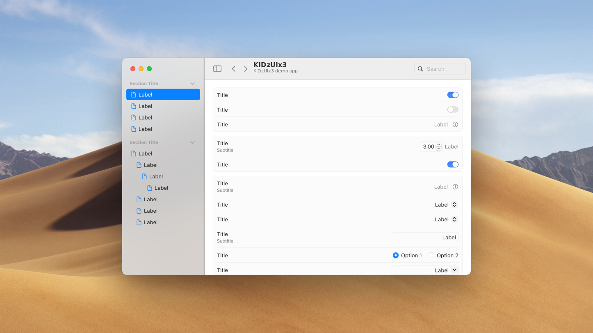
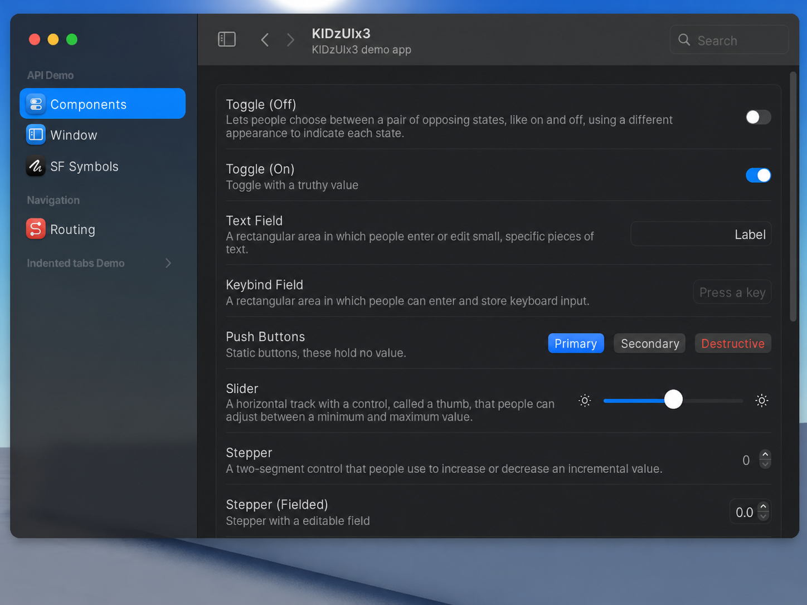
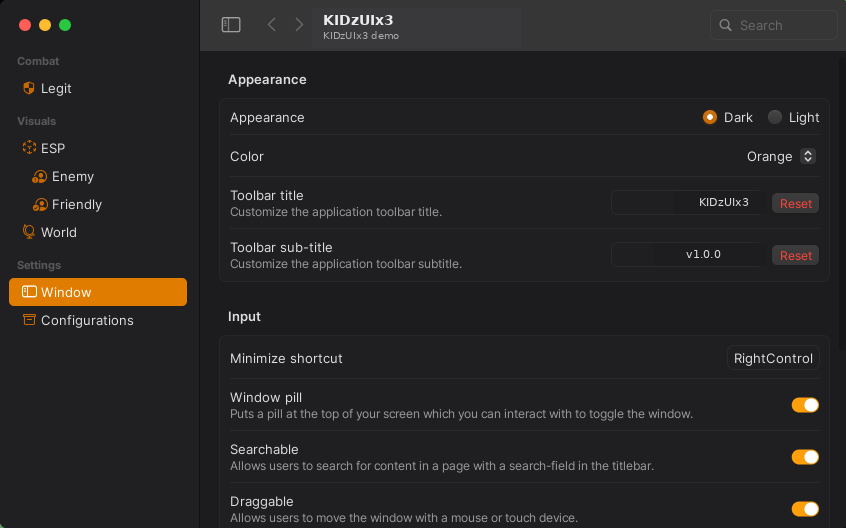
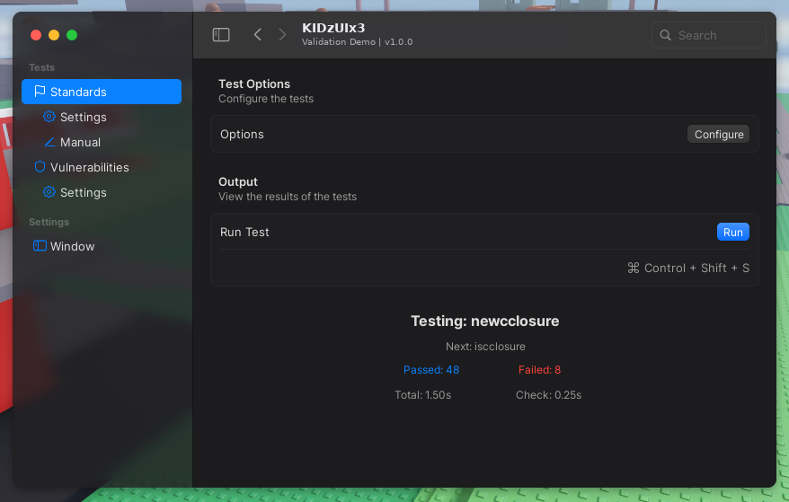
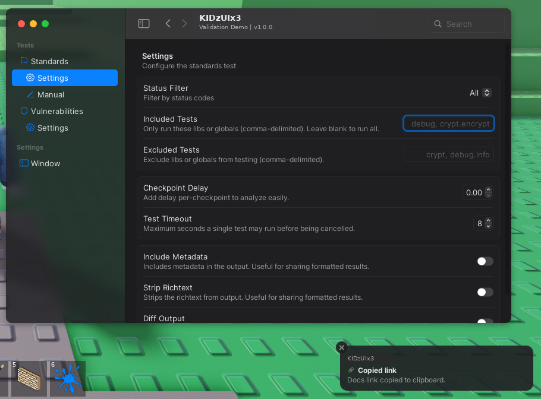
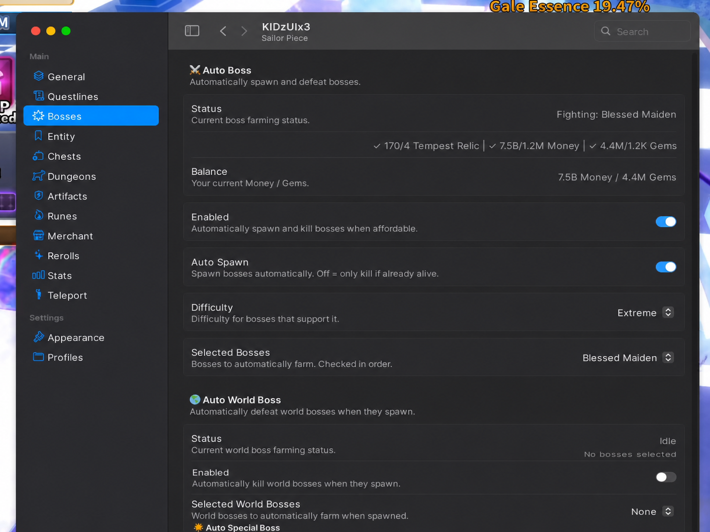

<!--markdownlint-disable MD041-->

[repo]: https://github.com/KIDZ5/KIDzUIx3
[docs]: https://kidz5.github.io/KIDzUIx3/
[actions]: https://github.com/KIDZ5/KIDzUIx3/actions/workflows/publish.yml
[stars]: https://github.com/KIDZ5/KIDzUIx3/stargazers

[badge/version]: https://img.shields.io/badge/version-1.0.0-0A84FF?style=flat-square
[badge/license]: https://img.shields.io/badge/license-MIT-34C759?style=flat-square
[badge/docs]: https://img.shields.io/github/actions/workflow/status/KIDZ5/KIDzUIx3/.github%2Fworkflows%2Fpublish.yml?branch=main&label=docs&style=flat-square
[badge/stars]: https://img.shields.io/github/stars/KIDZ5/KIDzUIx3?label=stars&style=flat-square

  <picture>
    <source media="(prefers-color-scheme: dark)" srcset="assets/KIDzUIx3_span_dark.png">
    <source media="(prefers-color-scheme: light)" srcset="assets/KIDzUIx3_span_light.png">
    
  </picture>

   

[![Version 1.0.0][badge/version]][repo]
[![MIT License][badge/license]][repo]
[![Documentation][badge/docs]][actions]
[![GitHub Stars][badge/stars]][stars]

**KIDzUIx3** is a Luau UI library by **KIDz**, based on the macOS Sequoia design language.

[Repository][repo] · [Documentation][docs]

## About KIDzUIx3

KIDzUIx3 is a retained-mode, user-centric UI library designed for polished Roblox/Luau interfaces. The API is fully typed and organized around reusable components, themes, accents, layouts, and application structures.

This repository is the official **KIDzUIx3** project under the **KIDz** name and the **KIDZ5** GitHub account.

## Usage

Use the [KIDzUIx3 documentation][docs] for installation, API references, components, themes, and examples.

- [Importing the Library](https://kidz5.github.io/KIDzUIx3/Getting%20Started/importing-the-library/)
- [The API](https://kidz5.github.io/KIDzUIx3/Getting%20Started/the-api/)
- [Components](https://kidz5.github.io/KIDzUIx3/Components/)

## Gallery

### KIDzUIx3 Demo

### KIDzUIx3 Theme Demo

### KIDzUIx3 Validation Demo

### KIDzUIx3 Sailor Piece Demo

## Version

The rebranded KIDzUIx3 project starts at **v1.0.0**.

## License and third-party software

KIDzUIx3 project code is distributed under the MIT License. Third-party dependencies, tools, platform assets, and code with explicit upstream attribution retain their own names, licenses, and attribution; those references are intentionally not rebranded.

## Documentation languages

The KIDzUIx3 documentation is available in:

- 🇺🇸 English: `https://kidz5.github.io/KIDzUIx3/`
- 🇹🇭 ภาษาไทย: `https://kidz5.github.io/KIDzUIx3/th/`

The language selector in the documentation header switches between both versions while preserving the current page where possible.
