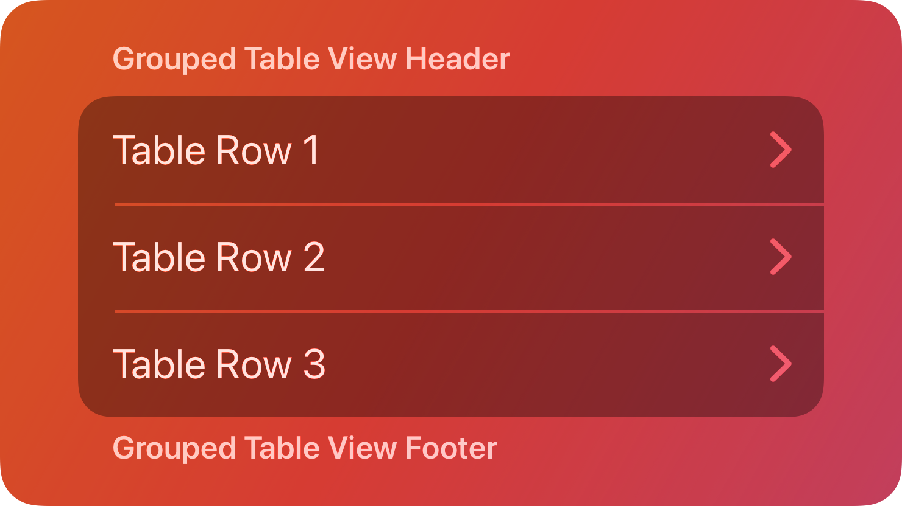

# Form — คอมโพเนนต์ Form

`Form` เป็นคอนเทนเนอร์แนวตั้งที่จัดองค์ประกอบอินเทอร์เฟซเป็นแถวอย่างชัดเจน พร้อมรูปแบบที่สม่ำเสมอ เช่น เส้นแบ่ง เพื่อช่วยให้โครงสร้างอ่านง่าย



## สรุป

### คุณสมบัติ

[ดูรายการทั้งหมดที่สืบทอดจาก `BaseComponent`](./index.md/#properties)

[ดูรายการทั้งหมดที่สืบทอดจาก `Frame`](https://create.roblox.com/docs/reference/engine/classes/Frame#summary-properties)

### เมธอด

[ดูรายการทั้งหมดที่สืบทอดจาก `Frame`](https://create.roblox.com/docs/reference/engine/classes/Frame#summary-methods)

### อีเวนต์

[ดูรายการทั้งหมดที่สืบทอดจาก `Frame`](https://create.roblox.com/docs/reference/engine/classes/Frame#summary-events)

## ชนิดข้อมูล

```luau
type FormProperties = Frame

type Form = BaseComponent & Components & FormProperties
```

### รูปแบบฟังก์ชัน

```luau
function(self, properties: FormProperties?): Form
```

## ตัวอย่าง

```luau
local form = tab:Form()

print(form:IsA("Frame")) --> true
print(form.ClassName) --> "Frame"
print(form.Type) --> "Form"
```
