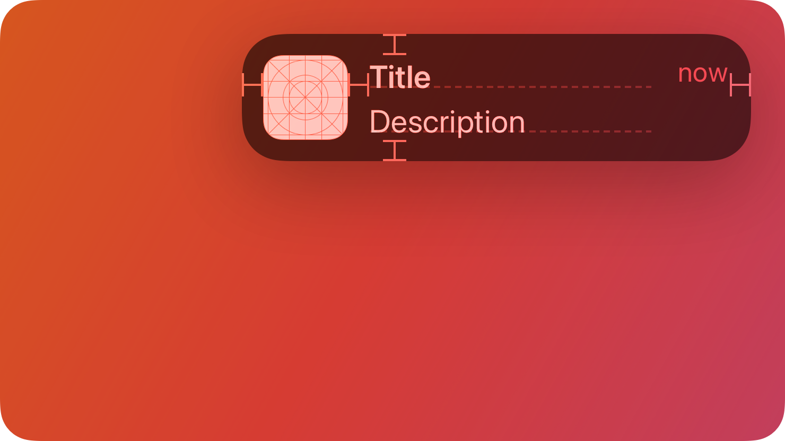

# Notification — คอมโพเนนต์ Notification

`Notification` ใช้แสดงข้อมูลสำคัญแบบชั่วคราวให้ผู้ใช้เข้าใจได้อย่างรวดเร็ว



## สรุป

### คุณสมบัติ

 | ชื่อ | ชนิด | คำอธิบาย | 
 | ---------- | ---------------- | ------------------------------------------------------------------------------------------------------------------- | 
 | `Title` | `#!luau string` | ข้อความหัวเรื่องหลักของการแจ้งเตือน | 
 | `Subtitle` | `#!luau string` | ข้อความรองสำหรับให้บริบทเพิ่มเติม | 
 | `App` | `#!luau string?` | ข้อความเสริมสำหรับระบุ feature หรือ app ที่ทำให้เกิดการแจ้งเตือน โดยระบบจะเปลี่ยนเป็นตัวพิมพ์ใหญ่อัตโนมัติ | 
 | `AppIcon` | `#!luau string?` | Asset ID ของรูปเสริมสำหรับแสดงไอคอนด้านซ้ายบน | 
 | `Icon` | `#!luau string?` | Asset ID ของรูปเสริมสำหรับแสดงไอคอนด้านซ้ายบนข้าง title | 
 | `Duration` | `#!luau number?` | ระยะเวลาเป็นวินาทีก่อนปิดการแจ้งเตือนอัตโนมัติ ค่าเริ่มต้นคือ `6` และใช้ `0` หากต้องการปิดด้วยตนเองเท่านั้น | 

[ดูรายการทั้งหมดที่สืบทอดจาก `BaseComponent`](./index.md/#properties)

[ดูรายการทั้งหมดที่สืบทอดจาก `Frame`](https://create.roblox.com/docs/reference/engine/classes/Frame#summary-properties)

### เมธอด

 | ชื่อ | รูปแบบ | คำอธิบาย | 
 | ------------- | -------------------------------------------------------------------- | ------------------------------------------------------------------------ | 
 | `Close` | `#!luau (self: Notification, fromUserInput: boolean?) -> nil` | ปิดการแจ้งเตือนด้วยตนเอง | 
 | `UpdateState` | `#!luau (self: Notification, age: number, instant: boolean?) -> nil` | อัปเดตสถานะการแสดงผลของการแจ้งเตือนตามตำแหน่งใน stack | 

[ดูรายการทั้งหมดที่สืบทอดจาก `Frame`](https://create.roblox.com/docs/reference/engine/classes/Frame#summary-methods)

### อีเวนต์

 | ชื่อ | พารามิเตอร์ | คำอธิบาย | 
 | -------- | ----------------------------------------------------------------- | ------------------------------------------------------------------------ | 
 | `Closed` | `#!luau (self: Notification, fromUserInput: boolean?) -> unknown` | ถูกเรียกเมื่อการแจ้งเตือนปิด ไม่ว่าจะจาก timeout หรือผู้ใช้ปิดเอง | 

[ดูรายการทั้งหมดที่สืบทอดจาก `Frame`](https://create.roblox.com/docs/reference/engine/classes/Frame#summary-events)

## ชนิดข้อมูล

```luau
type NotificationProperties = Frame & {
    Title: string,
    Subtitle: string,
    App: string?,
    AppIcon: string?,
    Icon: string?,
    Duration: number?,
    Closed: ((self: Notification, fromUserInput: boolean?) -> unknown)?,
}

type Notification = BaseComponent & Components & NotificationProperties & {
    Close: (self: Notification, fromUserInput: boolean?) -> nil,
    UpdateState: (self: Notification, age: number, instant: boolean?) -> nil,
}
```

### รูปแบบฟังก์ชัน

```luau
function(self, properties: NotificationProperties?): Notification
```

## ตัวอย่าง

```luau
local notification = app:Notification({
    App = "CHAT",
    AppIcon = "rbxassetid://132228700346004",

    Title = "New Message",
    Subtitle = "You received a new message from a friend.",
    Icon = KIDzUIx3.Symbols.bell, -- Icon appears beside the title label.

    Duration = 5,

    Closed = function(self, fromUserInput)
        print("Notification was dismissed! (from user: " .. tostring(fromUserInput) .. ")")
    end
})

-- Sometime later, if you need to manually close it:
-- notification:Close()
```
