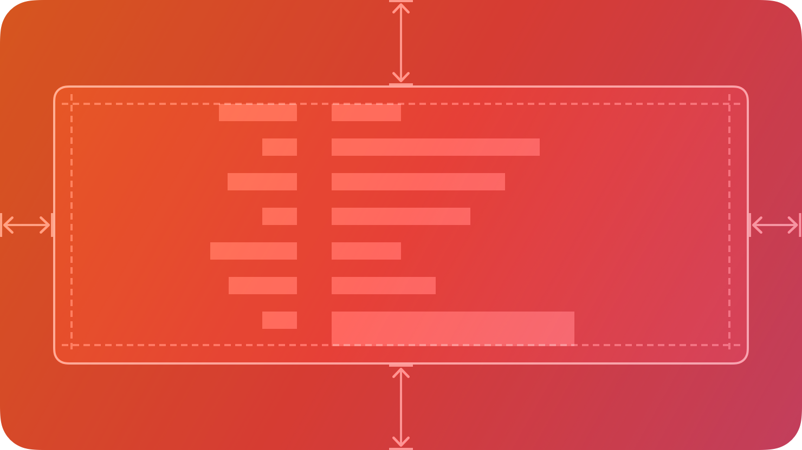

# Page — คอมโพเนนต์ Page

`Page` เป็นคอนเทนเนอร์ที่เก็บเนื้อหาในพื้นที่ที่เลื่อนได้ โดยทั่วไปใช้ร่วมกับ [Tabs](./Tab.md) เพื่อสร้างอินเทอร์เฟซหลายหน้าที่นำทางได้ แต่สามารถใช้แบบ Standalone ได้เช่นกัน



## สรุป

### คุณสมบัติ

[ดูรายการทั้งหมดที่สืบทอดจาก `BaseComponent`](./index.md/#properties)

[ดูรายการทั้งหมดที่สืบทอดจาก `ScrollingFrame`](https://create.roblox.com/docs/reference/engine/classes/ScrollingFrame#summary-properties)

### เมธอด

[ดูรายการทั้งหมดที่สืบทอดจาก `ScrollingFrame`](https://create.roblox.com/docs/reference/engine/classes/ScrollingFrame#summary-methods)

### อีเวนต์

[ดูรายการทั้งหมดที่สืบทอดจาก `ScrollingFrame`](https://create.roblox.com/docs/reference/engine/classes/ScrollingFrame#summary-events)

## ชนิดข้อมูล

```luau
type PageProperties = ScrollingFrame

type Page = BaseComponent & Components & PageProperties
```

### รูปแบบฟังก์ชัน

```luau
function(self, properties: PageProperties?): Page
```

## Pages และ Tabs

โดยทั่วไป Pages จะใช้ร่วมกับ [Tabs](./Tab.md) แต่ละ Tab จะมี Page ที่เชื่อมอยู่และจะแสดงเมื่อเลือกแท็บนั้น

เมื่อสร้าง Tab ระบบจะสร้าง Page ที่เกี่ยวข้องให้อัตโนมัติ:

### Tabs ที่ใช้ Pages แบบกำหนดเอง

คุณสามารถส่ง Page ที่สร้างเองให้กับ Tab ได้เช่นกัน:

```luau
local customPage = app:Page()

-- Add content to your page
customPage:Form():PageSection({ Title = "Settings" })

-- Pass it to the tab
local tab = section:Tab({
    Title = "Settings",
    Page = customPage,
})
```

### การนำทาง Page

ใช้เมธอด `Navigate` ของ Tab เพื่อสลับ Page ผ่านโค้ด:

```luau
local homePage = app:Page()
local settingsPage = app:Page()

local tab = section:Tab({
    Title = "Routing",
    Selected = false,
})

-- Setup home page
do
    local form = homePage:Form()
    form:Row():Right():Button({
        Label = "Go to Settings",
        Pushed = function()
            tab:Navigate(settingsPage)  -- Switch to settings page
        end,
    })
end

-- Setup settings page
do
    local form = settingsPage:Form()
    form:Row():Right():Button({
        Label = "Back to Home",
        Pushed = function()
            tab:Navigate(homePage)  -- Switch back to home page
        end,
    })
end

-- Show home page initially
tab:Navigate(homePage)
```

## ตัวอย่าง

```luau
local app = KIDzUIx3.New({
    Theme = KIDzUIx3.Themes.Light,
})

local window = app:Window({
    Title = "My App",
})

local section = window:Section({
    Disclosure = false,
})

local tab = section:Tab({
    Title = "Navigation",
    Icon = KIDzUIx3.Symbols.squareStack3dUp,
    Selected = false,
})

-- Create pages
local page1 = app:Page()
local page2 = app:Page()

-- Setup page 1
do
    local form = page1:Form()
    
    form:Row():Left():TitleStack({
        Title = "Home Page",
        Subtitle = "Welcome to the app",
    })
    
    form:Row():Right():Button({
        Label = "Go to Next Page",
        Pushed = function()
            tab:Navigate(page2)
        end,
    })
end

-- Setup page 2
do
    local form = page2:Form()
    
    form:Row():Left():TitleStack({
        Title = "Second Page",
        Subtitle = "You've navigated here",
    })
    
    form:Row():Right():Button({
        Label = "Back to Home",
        State = "Secondary",
        Pushed = function()
            tab:Navigate(page1)
        end,
    })
end

-- Show page 1 initially
tab:Navigate(page1)
```

```luau
local page = app:Page()

print(page:IsA("Frame")) --> true
print(page.ClassName) --> "ScrollingFrame"
print(page.Type) --> "Page"
```
