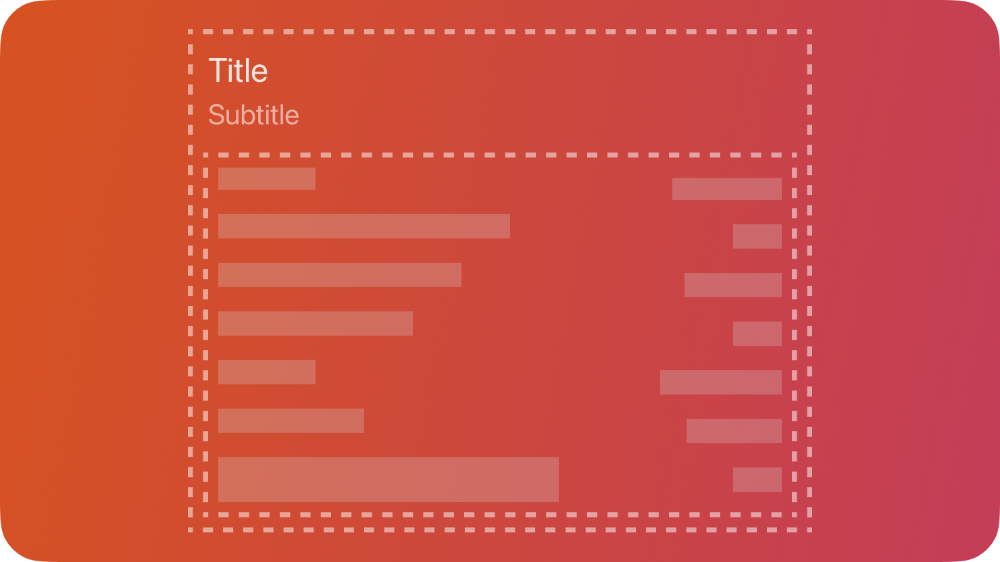

# PageSection — คอมโพเนนต์ PageSection

`PageSection` ใช้แบ่งเนื้อหาภายใน Page ออกเป็นส่วนที่อ่านง่ายด้วย Title stack เช่น หน้าการตั้งค่าอาจแบ่งเป็นหลายหมวด

- Appearance
- Input
- Effects



## สรุป

### คุณสมบัติ

 | คุณสมบัติ | ชนิด | คำอธิบาย | 
 | ---------- | ---------------- | ----------------------------------------------------------------------- | 
 | `Title` | `#!luau string?` | ชื่อของ section | 
 | `Subtitle` | `#!luau string?` | ชื่อรองของ section หากเป็น nil จะไม่แสดง subtitle | 

[ดูรายการทั้งหมดที่สืบทอดจาก `BaseComponent`](./index.md/#properties)

[ดูรายการทั้งหมดที่สืบทอดจาก `Frame`](https://create.roblox.com/docs/reference/engine/classes/Frame#summary-properties)

### เมธอด

[ดูรายการทั้งหมดที่สืบทอดจาก `Frame`](https://create.roblox.com/docs/reference/engine/classes/Frame#summary-methods)

### อีเวนต์

[ดูรายการทั้งหมดที่สืบทอดจาก `Frame`](https://create.roblox.com/docs/reference/engine/classes/Frame#summary-events)

## ชนิดข้อมูล

```luau
type PageSectionProperties = Frame & {
    Title: string?,
    Subtitle: string?,
}

type PageSection = BaseComponent & Components & PageSectionProperties
```

### รูปแบบฟังก์ชัน

```luau
function(self, properties: PageSectionProperties?): PageSection
```

## ตัวอย่าง

```luau
local pageSection = tab:PageSection({
    Title = "Effects",
    Subtitle = "These effects may be resource intensive across different systems.",
})

print(pageSection:IsA("Frame")) --> true
print(pageSection.ClassName) --> "Frame"
print(pageSection.Type) --> "PageSection"
```
