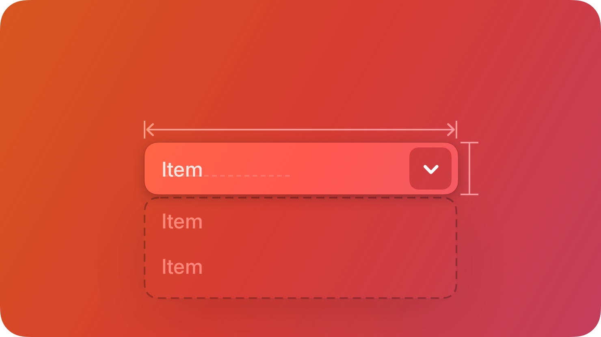

# PullDownButton — คอมโพเนนต์ PullDownButton

`PullDownButton` แสดงเมนูตัวเลือกที่ให้เลือกได้ครั้งละหนึ่งค่า



## สรุป

### คุณสมบัติ

 | คุณสมบัติ | ชนิด | คำอธิบาย | 
 | ---------- | ---------------------------- | -------------------------------------------------------------------------------------------------------------------------------------- | 
 | `Options` | `#!luau {[number]: string}?` | ใช้ตารางนี้กำหนดตัวเลือกล่วงหน้าได้ แต่การกำหนดด้วยวิธีนี้จะไม่สามารถเข้าถึง option instances โดยตรง | 
 | `Expanded` | `#!luau boolean?` | กำหนดสถานะการเปิด/ปิดของ dropdown | 
 | `Label` | `#!luau string?` | แสดง Label ข้างปุ่ม disclosure เพื่ออธิบายเนื้อหาของเมนู | 
 | `Value` | `#!luau number?` | index แบบตัวเลขของตัวเลือกที่ต้องการเลือก | 
 | `Anchor` | `#!luau DropdownMenuAnchor?` | กำหนดตำแหน่งที่เมนูจะเปิดแทนค่าเริ่มต้น | 

[ดูรายการทั้งหมดที่สืบทอดจาก `BaseComponent`](./index.md/#properties)

[ดูรายการทั้งหมดที่สืบทอดจาก `TextButton`](https://create.roblox.com/docs/reference/engine/classes/TextButton#summary-properties)

### เมธอด

 | เมธอด | รูปแบบ | คำอธิบาย | 
 | -------- | -------------------------------------- | ------------------------------------------------------------------------------------------------------------------- | 
 | `Option` | `#!luau (Name: string?) -> TextButton` | ใช้สร้างตัวเลือกแยกทีละรายการเมื่อจำเป็นต้องเข้าถึง option instances โดยตรง | 
 | `Remove` | `#!luau (Index: number?) -> nil` | ใช้ลบตัวเลือกออกจาก pull-down menu และระบบจะลบออกจากรายการ options อัตโนมัติ | 

[ดูรายการทั้งหมดที่สืบทอดจาก `TextButton`](https://create.roblox.com/docs/reference/engine/classes/TextButton#summary-methods)

### อีเวนต์

 | อีเวนต์ | รูปแบบ | คำอธิบาย | 
 | -------------- | ------------------------------------------------------------ | ---------------------------------------------------------------------------------- | 
 | `ValueChanged` | `#!luau ((self: PullDownButton, value: number) -> unknown)?` | ฟังก์ชัน callback ที่จะถูกเรียกเมื่อ property `Value` ถูกเปลี่ยน | 

[ดูรายการทั้งหมดที่สืบทอดจาก `TextButton`](https://create.roblox.com/docs/reference/engine/classes/TextButton#summary-events)

## ชนิดข้อมูล

```luau
type DropdownMenuAnchorConfig = {
    Object: GuiObject?,
    Element: GuiObject?,
    Label: GuiObject?,
    Option: number?,
    Offset: Vector2?,
    XOffset: number?,
    YOffset: number?,
}

type DropdownMenuAnchor = GuiObject | DropdownMenuAnchorConfig

type PullDownButtonProperties = TextButton & {
    Options: { [number]: string }?,
    Expanded: boolean?,
    Anchor: DropdownMenuAnchor?,
    Label: string?,
    Value: number?,
    ValueChanged: ((self: PullDownButton, value: number) -> unknown)?,
}

type PullDownButton = BaseComponent & Components & PullDownButtonProperties & {
    Option: (Name: string?) -> TextButton,
    Remove: (Index: number?) -> nil,
}
```

### รูปแบบฟังก์ชัน

```luau
function(self, properties: PullDownButtonProperties?): PullDownButton
```

## ตัวอย่าง

```luau
local pullDownButton = row:Right():PullDownButton({
    Label = "Action",
    Options = {
        "Action One",
        "Action Two",
    },
    ValueChanged = function(self, value: number)
        print("Action selected:", self.Options[value])
    end,
})

print(pullDownButton:IsA("TextButton")) --> true
print(pullDownButton.ClassName) --> "TextButton"
print(pullDownButton.Type) --> "PullDownButton"

local actionThree = pullDownButton:Option("Action Three")
pullDownButton.Value = 3 --> Action selected: "Action Three"

print(actionThree.ClassName) --> "TextButton"
pullDownButton:Remove(3)
```
