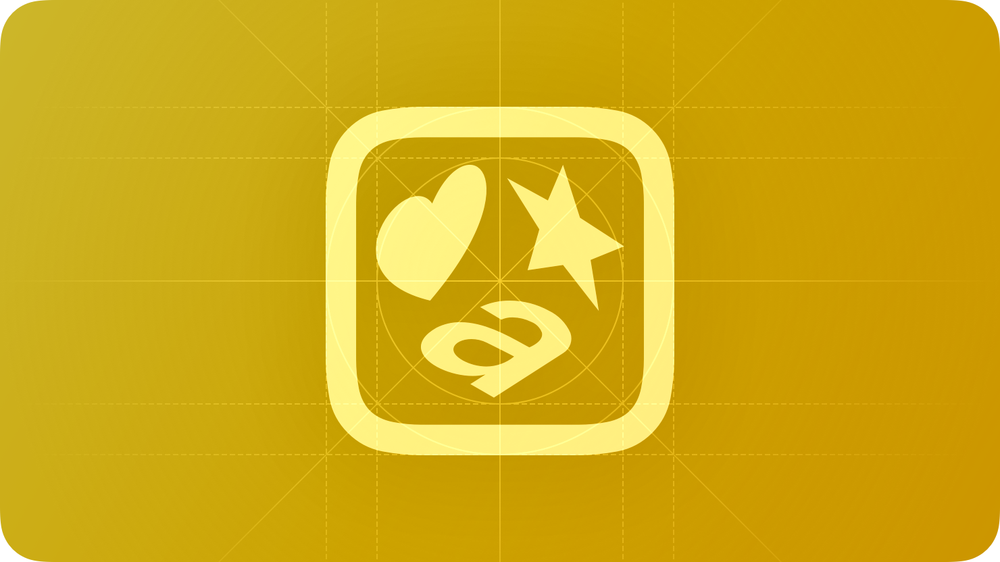

# Symbol — คอมโพเนนต์ Symbol

`Symbol` เป็นคอมโพเนนต์รูปภาพแบบคงที่ ใช้เพื่อเพิ่มบริบททางภาพและเอกลักษณ์ของแบรนด์ให้กับอินเทอร์เฟซ



## สรุป

### คุณสมบัติ

[ดูรายการทั้งหมดที่สืบทอดจาก `BaseComponent`](./index.md/#properties)

[ดูรายการทั้งหมดที่สืบทอดจาก `ImageLabel`](https://create.roblox.com/docs/reference/engine/classes/ImageLabel#summary-properties)

### เมธอด

[ดูรายการทั้งหมดที่สืบทอดจาก `ImageLabel`](https://create.roblox.com/docs/reference/engine/classes/ImageLabel#summary-methods)

### อีเวนต์

[ดูรายการทั้งหมดที่สืบทอดจาก `ImageLabel`](https://create.roblox.com/docs/reference/engine/classes/ImageLabel#summary-events)

## ชนิดข้อมูล

```luau
type SymbolProperties = ImageLabel & {
    Style: ("Primary" | "Secondary")?,
}

type Symbol = BaseComponent & Components & SymbolProperties
```

### รูปแบบฟังก์ชัน

```luau
function(self, properties: SymbolProperties?): Symbol
```

## ตัวอย่าง

```luau
local symbol = row:Right():Symbol({
    Image = KIDzUIx3.Symbols.sunMin,
})

print(symbol:IsA("ImageLabel")) --> true
print(symbol.ClassName) --> "ImageLabel"
print(symbol.Type) --> "Symbol"
```
