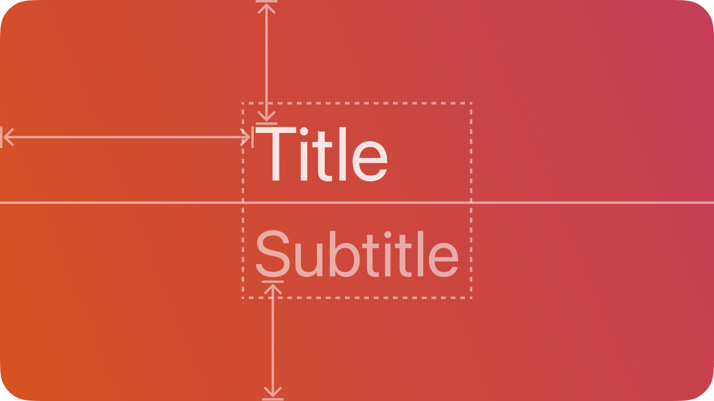

# TitleStack — คอมโพเนนต์ TitleStack

`TitleStack` เป็นกลุ่มข้อความแนวตั้งที่ประกอบด้วย title และ subtitle สำหรับแสดงผลแบบอ่านอย่างเดียว



## สรุป

### คุณสมบัติ

 | คุณสมบัติ | ชนิด | คำอธิบาย | 
 | ---------- | ---------------- | --------------------------------------------------------------------------------- | 
 | `Title` | `#!luau string?` | ข้อความของ title label | 
 | `Subtitle` | `#!luau string?` | ข้อความของ subtitle label หากเป็น nil จะไม่แสดง subtitle | 

[ดูรายการทั้งหมดที่สืบทอดจาก `BaseComponent`](./index.md/#properties)

[ดูรายการทั้งหมดที่สืบทอดจาก `Frame`](https://create.roblox.com/docs/reference/engine/classes/Frame#summary-properties)

### เมธอด

[ดูรายการทั้งหมดที่สืบทอดจาก `Frame`](https://create.roblox.com/docs/reference/engine/classes/Frame#summary-methods)

### อีเวนต์

[ดูรายการทั้งหมดที่สืบทอดจาก `Frame`](https://create.roblox.com/docs/reference/engine/classes/Frame#summary-events)

## ชนิดข้อมูล

```luau
type TitleStackProperties = Frame & {
    Title: string?,
    Subtitle: string?,
}

type TitleStack = BaseComponent & Components & TitleStackProperties
```

### รูปแบบฟังก์ชัน

```luau
function(self, properties: TitleStackProperties?): TitleStack
```

## ตัวอย่าง

```luau
local titleStack = row:Left():TitleStack({
    Title = "Toggle (Off)",
    Subtitle = "Lets people choose between a pair of opposing states, like on and off, using a different appearance to indicate each state.",
})

print(titleStack:IsA("Frame")) --> true
print(titleStack.ClassName) --> "Frame"
print(titleStack.Type) --> "TitleStack"
```
