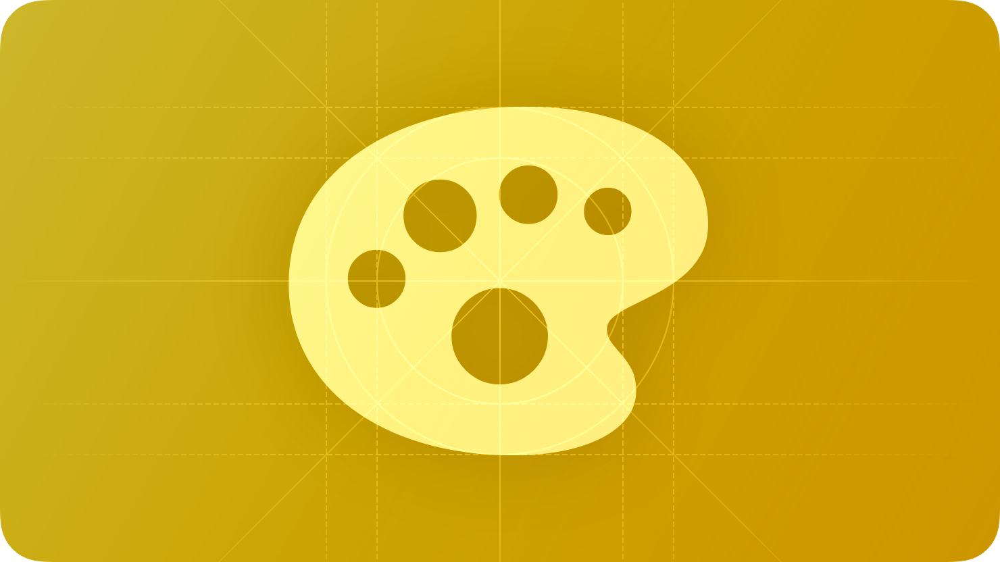

# บทนำการสร้างธีมและ Accent

คุณสามารถสร้าง Theme หรือ Override (Accent) ของตัวเองใน KIDzUIx3 โดยใช้ `ValueState` ภายใน `KIDzUIx3.Creator`

## ข้อมูลอ้างอิง

- [Value State](./valueState.md)
- [ธีม](./themes.md)
- [Accent](./accents.md)
