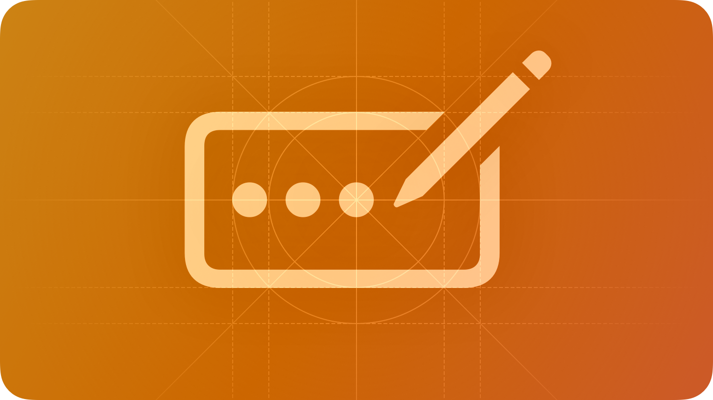

# บทนำ Custom Components

KIDzUIx3 ถูกออกแบบให้ขยายความสามารถได้ คุณสามารถลงทะเบียนคอมโพเนนต์ของคุณด้วย `KIDzUIx3.RegisterComponent` เพื่อให้ใช้งานได้กับ `App` และ `ComponentContext` ทุกตัว



## RegisterComponent — การลงทะเบียนคอมโพเนนต์
การลงทะเบียนคอมโพเนนต์ต้องระบุชื่อและฟังก์ชัน "maker"

### รูปแบบฟังก์ชัน

```luau
function(name: string, make: (self: any, properties: any) -> (any, Instance?))
```

### ตัวอย่างพื้นฐาน

```luau
KIDzUIx3.RegisterComponent("RedLabel", function(self, properties)
    local object = self:Label({
        Text = properties.Text or "Default Text",
        TextColor3 = Color3.fromRGB(255, 0, 0),
    })

    return object
end)

-- Now you can use it like any built-in component:
local app = KIDzUIx3.New()
app:RedLabel({ Text = "Hello World" })
```

## ทำไมจึงควรใช้ Custom Components?

1. **นำกลับมาใช้ซ้ำได้**: รวมรูปแบบ UI ที่ซับซ้อน เช่น แถวที่มีชื่อ Slider และป้ายแสดงค่า ให้เป็นคอมโพเนนต์เดียว
2. **ความสม่ำเสมอ**: ทำให้รูปแบบและพฤติกรรมของทั้งแอปสอดคล้องกันด้วยการสร้าง primitive ระดับสูง
3. **Theming**: Custom components จะสืบทอด theme และ accent จาก parent context โดยอัตโนมัติ

## ขั้นตอนถัดไป

- [การสร้างคอมโพเนนต์](./creating-a-component.md): เรียนรู้วิธีสร้างคอมโพเนนต์ตั้งแต่เริ่มต้น
- [โมดูลภายใน](./internal-modules.md): เรียนรู้การใช้ `Creator` และ `Binder` เพื่อสร้างคอมโพเนนต์ที่มีความสามารถสูง
