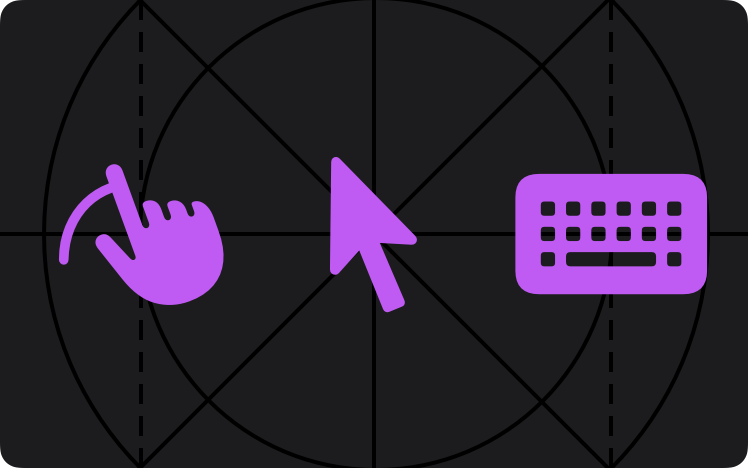

# เอกสาร KIDzUIx3

ยินดีต้อนรับสู่เอกสารอย่างเป็นทางการของ **KIDzUIx3** ไลบรารี UI สำหรับ Luau โดย **KIDz**

- โปรเจกต์: **KIDzUIx3**
- ผู้พัฒนา: **KIDz**
- GitHub: [`KIDZ5/KIDzUIx3`](https://github.com/KIDZ5/KIDzUIx3)
- เวอร์ชัน: **1.0.0**

!!! note "หมายเหตุเกี่ยวกับชื่อในโค้ด"
    ชื่อ API, properties, methods, events, ชนิดข้อมูล และตัวอย่างโค้ดจะคงชื่อจริงตามซอร์ส เพื่อให้สามารถคัดลอกไปใช้ได้ถูกต้อง ส่วนคำอธิบายและเมนูของเว็บไซต์เป็นภาษาไทย

## เริ่มต้นใช้งาน

- [การนำเข้าไลบรารี](Getting Started/importing-the-library.md)
- [การสร้างแอปพลิเคชัน](Getting Started/importing-the-library.md)
- [ตัวอย่าง](Getting Started/example.md)

## รีโพซิทอรี

ซอร์สโค้ดอย่างเป็นทางการอยู่ที่ [KIDZ5/KIDzUIx3](https://github.com/KIDZ5/KIDzUIx3)
